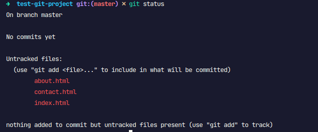
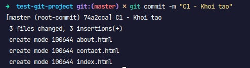
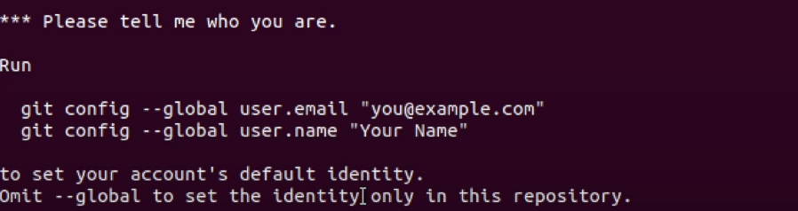

**1. git init**

- tạo ra thư mục `.git` bên trong thư mục của project (tạo ra local repo)
- thư mục `.git` được tạo ra, đây là nơi lưu trữ toàn bộ csdl của git cho project này
- biến thư mục đó thành 1 local repo
- bây giờ, chúng ta sẽ có thể thực hiện đc các lệnh git bên trong repo này.

**2. git status**

Vòng đời các file trong Git có thể ở một trong các trạng thái được biểu diễn như hình.


- Đầu tiên file mới thì nó ở trạng thái untracked (chưa được giám sát bởi git).
- Với những file được theo dõi bởi git thì có 3 trạng thái: unmodified, modified, staged
  - staged: được đánh dấu để chuẩn bị commit (lưu vào csdl), lúc này file ở index (staging area)
  - unmodified: không có sự thay đổi giữa working dir và trong csdl (với commit cuối).
  - modified: đã có sự thay đổi so với commit cuối.

Để biết trạng thái các file trong dự án ở trạng thái nào dùng lệnh kiểm tra trạng thái


Giải thích:

- On branch master: đang ở nhánh master (đừng quan tâm nó là gì, mình sẽ giải thích ở bài tiếp theo)
- No commits yet: chưa có commit (danh từ) nào cả, tức là chưa lưu dữ liệu nào vào git.
- Untracked files: những file chưa đc track, cần được `git add` để được theo dõi.

**3. git add**

- Đưa file ở trạng thái untrack hoặc modified từ working dir vào staging area
- Sau khi sử dụng `git add`, cùng check lại bằng `git status`:
  .png>)
  - file mới thêm vào sẽ chuyển từ màu đỏ(untracked) sang xanh (new file)
  - file ở trạng thái `modified` (màu đỏ) sang `modified` (màu xanh)
  - add tất cả những thay đổi: `git add .`
    .png>)
  - 1 số tham số phổ biến:
    - `git add filename` thêm file có tên chỉ ra trong tham số
    - `git add *.c` tất cả các file có phần mở rộng .c
    - `git add -A` thêm mọi thứ có sự thay đổi (file mới, xóa file, nội dung thay đổi ...)
    - `git add .` thêm mọi thứ trừ loại xóa file
    - `git add -u` thêm mọi thứ trừ file mới

**4. git commit**

- đóng gói những thay đổi (màu xanh lá cây) mà bạn đã `git add` thành 1 `object`, dán cho nó 1 `hash id` (40 ký tự) và đưa nó vào csdl.
- sử dụng tham số `-m` để viết 1 Messages nhằm mục đích note lại commit này đã làm gì nhằm mục đích cho mình cũng như ng khác hiểu mình đã commit cái gì. Quy chuẩn: ngắn gọn (ít hơn 50 ký tự), viết hoa chữ cái đầu, không kết thúc = dấu .
  
  Trong đó:
  - `74a2cca`: commit id
  - 3 file changed, 3 insertion+: 2 file đã thay đổi, trong đó có 3 thêm mới
- Nếu cài git lần đầu, bạn sẽ chưa đc commit mà sẽ nhận được thông báo có dạng như sau:
  

=> hãy thực hiện cấu hình:

```
git config --global user.name "<your_username_here>"
git config --global user.email "<your_gmail_here>"
git config --list
```

- sau khi commit, check lại bằng `git status`:
  .png>)

  - working tree clean: điều này có nghĩa là nội dung trong working dir và nội dung lưu trong commit cuối là không có gì khác nhau.

- Trong trường hợp thay đổi ít hoặc commit thiếu, chúng ta có thể commit và bổ sung ngay vào commit cuối. Nghĩa là lịch sử sẽ k phát sinh commit mới mà nội dung thay đổi sẽ cập nhật vào commit cuối.
  ```
  git commit --amend -m "amend description message"
  ```
  .png>)
