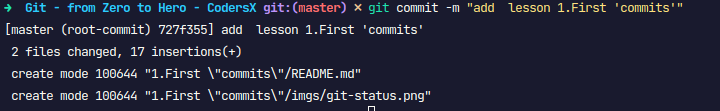
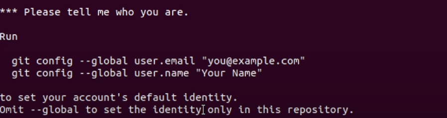

**1. git init**

- tạo ra thư mục `.git` bên trong thư mục của project
- `.git` lưu thông tin lịch sử của project

**2. git status**

- tracking project
  

Giải thích:

- On branch master: đang ở nhánh master (đừng quan tâm nó là gì, mình sẽ giải thích ở bài tiếp theo)
- No commits yet: chưa có commit (danh từ) nào cả
- Untracked files: có file chưa đc track, cần được `git add` để gộp vào những cái sẽ commit (động từ).

**3. git add**

- Sau khi sử dụng `git add`, cùng check lại bằng `git status`:
  .png>)
  .png>)
  - file đã chuyển từ màu đỏ sang xanh

**4. git commit**

- đóng gói những thay đổi (màu xanh lá cây) mà bạn đã `git add` thành 1 `object` và dán cho nó 1 `label`
- sử dụng tham số `-m` để note lại commit này đã làm gì nhằm mục đích cho mình cũng như ng khác hiểu mình đã commit cái gì.

  Trong đó:
    - `727f355`: commit id
    - 2 file changed, 17 insertion+: 2 file đã thay đổi, trong đó có 17 thêm mới
- Nếu cài git lần đầu, bạn sẽ chưa đc commit mà sẽ nhận được thông báo có dạng như sau:


=> hãy thực hiện cấu hình:
```
git config --global user.name "<your_username_here>"
git config --global user.email "<your_gmail_here>"
```
- Kiểm tra lại cấu hình: `git config --list`