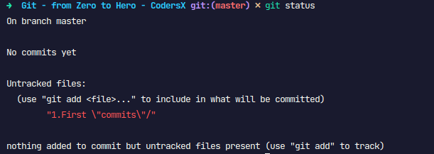

**1. git init**

- tạo ra thư mục `.git` bên trong thư mục của project
- `.git` lưu thông tin lịch sử của project

**2. git status**

- tracking project
  

Giải thích:

- On branch master: đang ở nhánh master (đừng quan tâm nó là gì, mình sẽ giải thích ở bài tiếp theo)
- No commits yet: chưa có commit (danh từ) nào cả
- Untracked files: có file chưa đc track, cần được `git add` để gộp vào những cái sẽ commit (động từ).

3. git add
