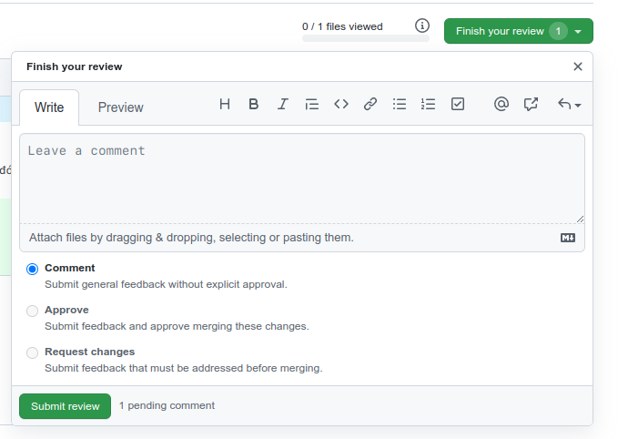

Cách để làm việc nhóm = pull request:

// Pull request
// 1. git checkout -b <feature_branch>
// 2. git push origin <branch>
// 3. createapull request on Github
// 4. review code
4.1.review code online(github)
4.2.fetch branch into local to test offline(optional)
4.3.approve the pull request
// 5. merge to master

Giải thích: Trong project có nhiều công việc nhỏ đc phân cho từng thành viên. Thông thường với mỗi công việc sẽ tạo 1 branch riêng, làm việc trên đó rồi push branch đó lên github. Trên github, chủ branch đó sẽ tạo **pull request** vào **master**, sau đó các member sẽ review code, khi k có vấn đề gì sẽ thực hiện merge vào nhánh master.

## Chi tiết cách thực hiện

- Trên feature tách ra từ base brach (thường là master) tiến hành push brach lên github
  

- Trên github.com, Ng chủ của branch tạo pull request (vào master) để các thành viên cùng review code
  

- 1 pull request open, các thành viên có thể vào review code online và submit review:
   -> 

- chủ branch tạo pull request vào xem và tiến hành chỉnh sửa lại theo review và push:
  

- các thành viên vào review lần nữa, mọi thì ok thì chủ branch master `merge pull request` thôi =))
- Kết quả, mỗi khi merge một feature branch về master branch sử dụng pull request thì nó sẽ tạo ra một merge commit và bỏ vào master branch.
  
