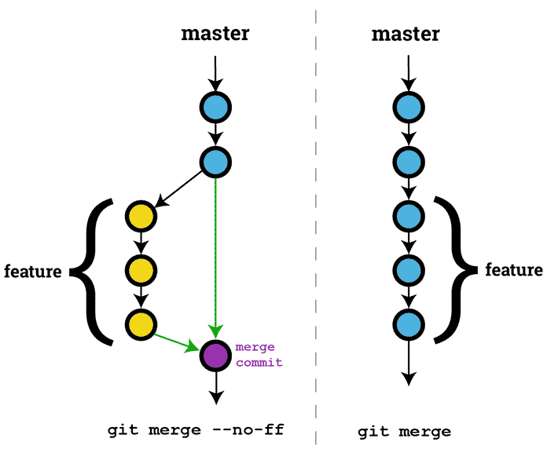

# Merge và Rebase ???

Trước hết, nói đến chức năng của cả rebase và merge, thì chúng có chức năng khá tương đồng nhau là để tích hợp các thay đổi từ các branches vào một base branch (ở đây có thể hiểu là master). Nói là nói vậy, nhưng mà cách tổ chức và hoạt động của hai cái hoàn toàn khác nhau.

## MERGE

Khi sử dụng merge để tích hợp 2 nhánh với nhau. Câu lệnh merge sẽ lấy snapshot mới nhất của mỗi branch rồi combine với nhau để tạo ra một merge commit. Merge commit sẽ có parents là từ 2 nhánh khác nhau. Vậy đơn giản, mỗi khi merge một feature branch về master branch thì nó sẽ tạo ra một merge commit và bỏ vào master branch, việc làm này khá đơn giản. Nhưng thử tượng tưởng, nếu chúng ta có hàng chục feature branches, thì lúc merge vào master branch phải tạo ra hàng chục merge commit và mỗi commit đó sẽ có parents là 1 feature branch và master branch. Việc này dẫn tới cây trên git của bạn sẽ cực kì rối, khó nhìn và đau mắt :)) Dưới đây là một ví dụ:

Nhưng mà cách này lại giúp chúng ta trace được là những changes trên master đến từ branch nào để giúp cho việc tìm kiếm và sửa lỗi (nếu có) được dễ dàng hơn.

## REBASE

Trái ngược với cách đau mắt ở trên, khi sử dụng rebase chúng ta lại có được một cái history dễ nhìn hơn, thẳng hàng, đẹp đẽ hơn. Vậy thì cách hoạt động của rebase khác gì merge???… Khi chúng ta sử dụng rebase, thì lúc cần tích hợp và nhánh master, nó sẽ đem tất cả các changes từ nhánh feature hay nói cách khác copy tất cả các changes từ nhánh feature đặt lên đầu của master. Cách này có vẻ khá nặng nề, thay vì lấy tất cả các changes từ commit mới nhất của nhánh feature thì nó lại đi chạy từ đâu đến cuối => rewrite. Có thể hiểu là nó sẽ lấy tất cả các commit từ lúc chúng ta tách nhánh feature từ master, rồi đem từng commit đó đặt lên lần lượt lên master theo đúng thứ tự, do đó nên trên cây của master chúng ta có thể thấy được tất cả từng commit trên feature branch thay vì 1 merge commit duy nhất so với cách merge.

## MERGE HAY REBASE ??

Best practice khuyên là:

- Rebase origin/branch vào branch (pull)
- Merge feature branch vào master (hoặc một shared branch nào đó)

Nếu là người không rành và có kinh nghiệm làm việc với rebase thì merge sẽ là cách làm an toàn hơn, nó sẽ không phá mất cái history của repo, cho nên với cách merge cho một shared branch thì việc nhiều người làm chung trên một branch sẽ không xảy ra sự cố, mặc dù history sẽ khá nhập nhằng. Nếu sử dụng rebase không đúng cách nó có thể gây nguy hiểm, nếu người khác sử dụng chung branch đó mà không rebase khi pull, điều này có thể gây ra mất commit của người đó. Còn việc lựa chọn sử dụng merge hay rebase nó phụ thuộc vào git flow của project đó, nhưng người bên đội SA hoặc PM sẽ quyết định nên sử dụng cái nào. Như vậy tóm lại:

- Rebase: nếu muốn một history rõ ràng dễ nhìn, hay còn gọi là linear history, và tránh được trường có thêm các merge commit
- Merge: nếu muốn lưu vết cũng như bảo toàn được history của repo (vd: xem được commit này là từ branch nào,…)và tránh trường hợp rewrite lại tất cả các changes.
