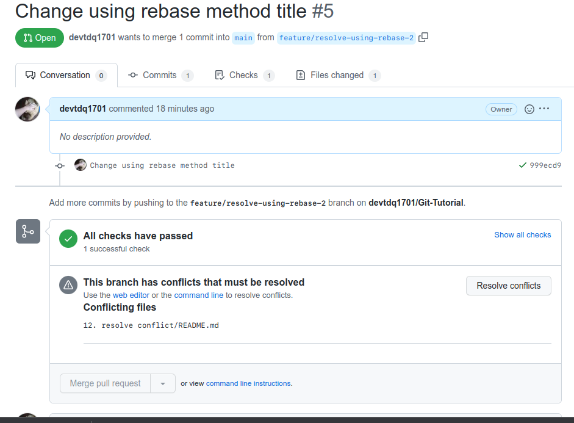
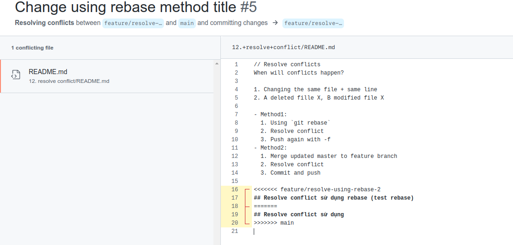
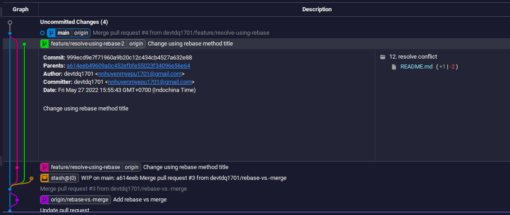
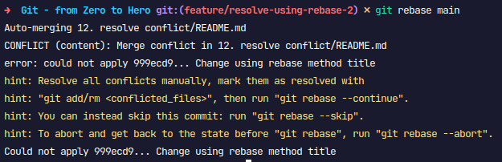
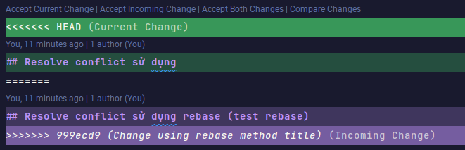
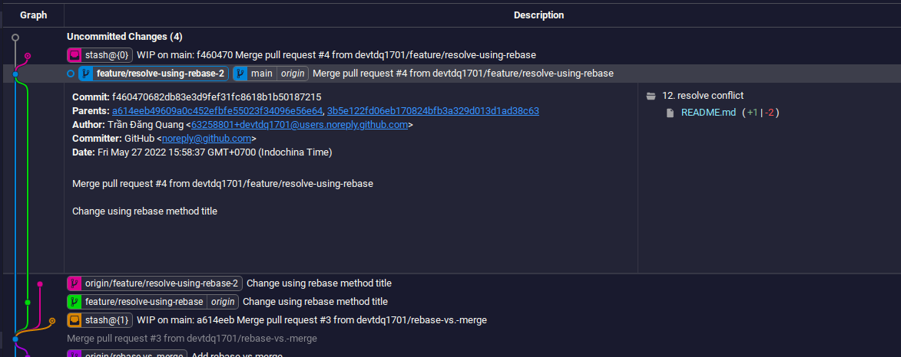

// Resolve conflicts
When will conflicts happen?

1. Changing the same file + same line
2. A deleted fille X, B modified file X

- Method1:
  1. Using `git rebase`
  2. Resolve conflict
  3. Push again with -f
- Method2:
  1. Merge updated master to feature branch
  2. Resolve conflict
  3. Commit and push

## Resolve conflict sử dụng rebase

VD: ô A và B code trên 2 feature branch khác nhau nhưng lại cùng chỉnh sửa 1 file trên cùng 1 số dòng. Sau đó có 2 pull request đồng thời mở. 1 pull request được merge trc và pull request sau sẽ xảy ra hiện tượng conflict
  

<!-- - quy tắc: conflict trên branch nào thì chủ branch đó sẽ đi fix (trong ví dụ này là `feature/resolve-using-rebase-2`).
- checkout sang feature/resolve-using-rebase-2 và thực hiện rebase master:
- lúc này nó sẽ hiên lên thông báo conflict
  
- bh phải sửa file để khắc phục conflict và merge
  
- tiếp theo, add file đã sửa mà chạy `git rebase --continue`
- rebase sẽ thực hiện update lại commit cũ
  
- Tóm lại: việc rebase thực hiện mang gốc của feature branch lắp vào đầu master -->

Ref:

- https://www.gitkraken.com/learn/git/problems/git-pull-rebase#:~:text=Git%20pull%20allows%20you%20to,one%20branch%20onto%20another%20branch.
- https://www.gitkraken.com/learn/git/problems/git-pull-vs-fetch
- https://www.atlassian.com/git/tutorials/merging-vs-rebasing
- https://xuanthulab.net/lam-viec-voi-nhanh-branch-tao-nhanh-gop-nhanh-trong-git.html
