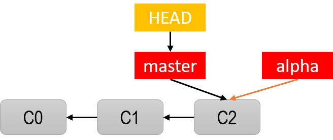

## Nhánh chính master

**1. Khởi tạo dự án với 3 commit**

```bash
$ git init                      #khởi tạo Repo
$ touch 0.txt                   #Tạo một file mới trong thư mục làm việc
$ git add .                     #đưa vào stage
$ git commit -m"C0"             #commit

$ touch 1.txt
$ git add .
$ git commit -m"C1"

$ touch 2.txt
$ git add .
$ git commit -m"C2"
```

Kết quả là nhánh master có 3 snapshot (ký hiệu là C0, C1, C2 như hình dưới:


**2. Lịch sử commit**

Xem lại lịch sử commit: nó cho biết đang làm việc trên nhánh có tên `master`, và đang ở vị trí commit cuối với mã hash là `0d7ae45` C2

```bash
$ git log --pretty=oneline
0d7ae45f93922e40c2c8dfdd14721e77476f6d01 (HEAD -> master) C2
927163bd31669a7651621e91982afbdf6f30cc1f C1
efab635085727cefd2b0271e7b72b9fd37a62614 C0
```

**_Note_**: Ví trí hiện tại bạn đang làm việc ở nhánh nào, ở commit cuối nào thể hiện bằng một con trỏ có tên là HEAD

**3. Xem danh sách các nhánh - branch**

```bash
$ git branch
* master
```

## Tạo nhánh mới, chuyển nhánh làm việc

**4. Tạo một nhánh mới**

```
$ git branch alpha
```

Nhánh có tên alpha đã được tạo, gõ lệnh git branch sẽ thấy Repo có 2 nhánh master và alpha nhưng con trỏ HEAD vẫn cho biết làm việc ở nhánh master. Nhánh alpha khởi đầu từ commit C2 (kế thừa master từ C2 trở về trước), hình biểu diễn tả như hình dưới


**5. Chuyển nhánh làm việc mới**

```
$ git checkout alpha
```

Cả master và alpha hiện đang trỏ đến commit C2 nhưng con trỏ HEAD cho biết đang làm việc với nhánh alpha, xem hình bên, có thể dùng lệnh git branch kiểm tra


**6. Thực hiện commit trên nhánh mới**

Đang trên nhánh **alpha** thực hiện thay đổi và commit

```
$ touch 3.txt                   #Tạo một file mới trong thư mục làm việc
$ git add .                     #đưa vào stage
$ git commit -m"C3"             #commit
```

**7. Xem lại lịch sử commit của nhánh alpha**

```
git log --pretty=oneline
c7d81e3771b61c97c1b6e661acdb9b25ec9cb199 (HEAD -> alpha) C3
0d7ae45f93922e40c2c8dfdd14721e77476f6d01 (master) C2
927163bd31669a7651621e91982afbdf6f30cc1f C1
efab635085727cefd2b0271e7b72b9fd37a62614 C0
```

Thấy nhánh alpha có một commit C3, và kế thừa các commit cũ của master bắt đầu từ C2.

Nhìn hình trên thấy nhánh master dừng lại ở commit cuối C2, với các commit cũ hơn C1, C0. Nhánh đang làm việc là alpha có một commit mới là C3, và các commit cũ kế thưa từ nhánh cha master C2, C1, C0

**8. Tiếp tục tạo sự thay đổi và commit trên nhánh alpha**

```
$ echo "Update new content to file" > 1.txt  #thêm nội dung mới vào file 1.txt
$ git add .
$ git commit -m"C4"
```


Như vậy ở commit cuối, nhánh alpha thư mục làm việc có các file: 0.txt, 1.txt, 2.txt, 3.txt, so với master nó có thêm file 3.txt và file 1.txt có chèn nội dung mới

**9. Chuyển về làm việc với nhánh master**

```
git checkout master
```

Trong thư mục làm việc đã quay về trạng thái ở commit cuối của nhánh `master`: `0.txt, 1.txt, 2.txt` còn file `1.txt` chưa cập nhật nội dung gì. Con trỏ HEAD giờ cũng trỏ vào nhánh master


**10. Tạo sự thay đổi và commit cho nhánh master**

```
$ touch 4.txt
$ echo "Update code" > 0.txt
$ git add .
$ git commit -m"C5"
```


**11. Tiếp tục tạo nhánh mới rẽ từ master**

Hiện giờ đang đứng ở master và phát triển code theo kế hoạch, nhưng code trong master cần sửa và kiểm tra ngay, với mong muốn quá trình sửa đổi code và kiểm lỗi không làm rối các dòng code đang làm với master có thể tạo ra ngay một nhánh mới đặt tên `sualoigap`, ngay sau đó chuyển sang nhánh `sualoigap` để làm việc

```
$ git branch sualoigap              #tạo nhánh
$ git checkout sualoigap            #chuyển nhánh
```

Giờ đang làm việc trên nhánh sualoigap (con trỏ HEAD), các snapshot và các nhánh trên toàn bộ Repo như hình: master và sualoigap đang cùng trỏ đến commit C5


**12. Tạo sự thay đổi và commit trên nhánh sualoigap**

```
$ echo "Sua loi tren 2.txt" > 2.txt
$ git add .
$ git commit -m"C6"
```


Tương tự có thể thực hiện thêm nhiều commit trên sualoigap:

```
$ echo "Sua loi tren 1.txt" > 1.txt
$ git add .
$ git commit -m"C7"
```


## Branch Merge

**13. Trộn nhánh sualoigap vào nhánh master**

Khi đã hoàn thành nhiệm vụ trên nhánh sualoigap nếu muốn các kết quả của nhánh này tích hợp thay đổi vào master thì tiến hành gộp 2 nhánh lại gọi là merge. Để làm việc đó cần chuyển về làm việc trên nhánh master bằng lệnh checkout rồi cho nhánh sualoigap gộp vào master bằng lệnh merge:

```
$ git checkout master               #tạo nhánh
$ git merge sualoigap               #hợp nhất
```


## Xóa nhánh

**14. xóa nhánh sualoigap**

Khi nhánh sualoigap đã gộp vào master, nếu không còn nhu cầu làm việc trên nhánh này thì có thể xóa nó đi như sau:

```
$ git branch -d sualoigap
$ git branch
  alpha
* master
```

Đã xóa, lệnh git branch liệt kê chỉ còn hai nhánh alpha và master và đang làm việc trên master. Xem lại log master thấy như sau:

```
$ git log --pretty=oneline
89b19cb2a226bf609bb8330dc1e2312f76bffd0e (HEAD -> master) C7
eda207ba7b5a02f3687eb0c71f08b627ce98a7ca C6
2c3fa4d3fe0035844314c232324afca9ffc1a288 C5
0d7ae45f93922e40c2c8dfdd14721e77476f6d01 C2
927163bd31669a7651621e91982afbdf6f30cc1f C1
efab635085727cefd2b0271e7b72b9fd37a62614 C0
```

Vậy nhánh master có các snapshot C0, C1, C2, C5, C6, C7 và hình ảnh snapshot trên Repo hiện tại như sau


## Xử lý xung đột khi gộp nhánh

Bây giờ giả sử có nhu cầu gộp code tại nhánh alpha vào nhánh master, trường hợp này không đơn giản như cách gộp nhánh sualoigap ở trên. Do cả 2 nhánh có nhiều commit kể từ thời điểm rẽ nhánh nên khi gộp nó sẽ xem xét sự thay đổi trên cả 2 nhánh tại ba điểm (three-way), thời điểm commit cuối của các nhánh và thời điểm rẽ nhánh, đó là các commit với snapshot C2, C4, C7 như hình dưới:


Như hình phía trên, Repo có 2 nhánh, điểm rẽ là ở snapshot C2 (có mã hash: 0d7ae45), nghĩa là ở thời điểm đó master và alpha giống nhau, hãy trở về thời điểm snapshot C2 bằng lệnh git checkout

```
$ git checkout 0d7ae45f          #0d7ae45f là hash của commit C2
HEAD is now at 0d7ae45 C2
```

Mở thư mục làm việc ra, thì lúc này đang có các file: 0.txt, 1.txt, 2.text với nội dung trống bên trong.

Kiểm tra nhánh alpha ở commit cuối với snapshot C4:

```
$ git checkout alpha
```

Mở thư mục làm việc ra ta thấy lúc này có các file: 0.txt, 1.txt, 2.txt, 3.txt file 1.txt có nội dung Update new content to file còn các file khác rỗng.

Kiểm tra nhánh master ở commit cuối với snapshot C7:

```
$ git checkout master
```

Mở thư mục làm việc ra ta thấy lúc này có các file: 0.txt, 1.txt, 2.txt, 4.txt file 0.txt có nội dung Update code, file 1.txt có nội dung Sua loi tren 1.txt, 2.txt có nội dung Sua loi tren 2.txt còn file 4.txt rỗng

Tổng kết lại có bảng sau, bảng này là kết quả so sánh nhánh với thời điểm snapshot C2, những ô có nền xanh là bản giữ lại sau khi merge, những ô màu đỏ là tình trạng xung đội nếu merge


Bảng phân tích trên cho biết sẽ có 1 xung đột xảy ra nếu gộp nhánh alpha vào master, đó chính là nội dung của file 1.txt, Git không biết là giữ lại bản nào. Ở tình trạng này cần phải xử lý các xung đột sau khi merge

**15. gộp nhánh alpha vào master**

```
$ git checkout master
$ git merge alpha       #gộp nhánh
Auto-merging 1.txt
CONFLICT (content): Merge conflict in 1.txt
Automatic merge failed; fix conflicts and then commit the result.
```

Dòng thông báo cho biết vẫn đang trong quá trình merge, nhưng có một xung đột về nội dung trong file 1.txt chờ bạn xử lý nó. Không như trường hợp không có xung đột nào, trường hợp này khi gộp (merge) Git không tự động tạo ra commit mới và nó tạm dừng để bạn xử lý từng file có xung đột và tạo ta 1 commit sau khi xử lý hết xung đột.

```
git status
On branch master
You have unmerged paths.
  (fix conflicts and run "git commit")
  (use "git merge --abort" to abort the merge)

Changes to be committed:

        new file:   3.txt

Unmerged paths:
  (use "git add <file>..." to mark resolution)

        both modified:   1.txt
```

Nó đã cho biết có file 3.txt ở sẵn trong stage những 1.txt chưa được merge

16. xử lý xung đột khi gộp nhánh

Có bao nhiêu file xung đột thì mở ra để quyết định lấy nội dung nào trong file đó. Ở đây file xung đột là 1.txt, mở ra thấy nội dung như sau:


Bạn thấy nội dung xung đột nó đánh dấu bên trong các ký hiệu, nội dung nằm giữa <<<<<<< HEAD và ======= là nội dung có từ master, còn nội dung nằm giữa ======= và >>>>>>> alpha là nội dung từ alpha. Giữa hai nội dung đó lấy nội dung nào thì giữ, còn lại thì xóa hết. Ví dụ file trên giữ lại nội dung như sau (nội dung từ alpha)

```
Update new content to file
```

Sau khi xử lý hết các xung đột trong từng file bằng cách như vậy, thì tiến hành đưa file vào stage và tạo ra một commit để hoàn thành việc gộp nhánh

```
$ git add .
$ git commit -m"C8"
```

Xem lại lịch sử commit trên nhánh master và alpha bằng lệnh:

```
$ git checkout master
$ git log --oneline
a252058 (HEAD -> master) C8
89b19cb C7
eda207b C6
2c3fa4d C5
bbc3757 (alpha) C4
c7d81e3 C3
0d7ae45 C2
927163b C1
efab635 C0
```

## Trộn gộp nhánh Rebase

17. tạo nhánh mới từ một thời điểm trong lịch sư commit

```
$ git checkout 2c3fa4d
You are in 'detached HEAD' ...
HEAD is now at 2c3fa4d C5
$ git checkout -b beta              #Tạo nhánh mới
$ git branch                        #Danh sách các nhánh
  alpha
* beta
  master
```

18. tạo sự thay đổi thực hiện 2 commit trên beta

```
$ touch 5.txt                           #Tạo một file mới trong thư mục làm việc
$ git add .
$ git commit -m"C9"                     #commit
$ echo "Modify from Beta" > 2.txt       #thay nội dung file 2.txt đang có
$ git add .
$ git commit -m"C10"                    #commit
```


19. gộp nhánh với rebase

Có thể gộp nhánh beta vào master bằng merge ở trên, nếu vậy nó sẽ tạo ra một commit như là điểm gộp nhánh bằng cách kết hợp C10, C8 có so sánh với C5 (three-way). Tuy nhiên đôi khi bạn muốn việc gộp đó lại thực hiện theo cách cập nhật những gì thay đổi trên C10 của beta vào C8 của master mà không phải tạo ra một commit - snapshot nối tiếp, để làm điều đó thì dùng đến rebase

Với rebase thì mọi commit trên nhánh này sẽ có trong một nhánh khác. Ví dụ chạy lệnh reabase để mọi thứ trong master áp dụng vào beta:

```
$ git checkout beta
$ git rebase master
```

Quá trình rebase có thể tạm dừng do có thể có xung đột phiên bản, bạn xử lý như trên, mở file có xung đột ra sửa giữ lại nội dung nào, sửa xong gõ lệnh sau để tiếp tục rebase

```
$ git add .
$ git rebase --continue
```


Nhánh beta đã gồm tất cả các commit từ C8 về trước của master, master vẫn dừng lại ở C8, nếu muốn quay về master và merge nó với beta để có được phiên bản hợp nhất, có trỏ HEAD dịch về cuối tới snapshot C10

```
$ git checkout master
$ git merge beta
$ git log --oneline

544511a (HEAD -> master, beta) C10
be103d9 C9
1a90428 C8
89b19cb C7
eda207b C6
2c3fa4d C5
bbc3757 (alpha) C4
c7d81e3 C3
0d7ae45 C2
927163b C1
efab635 C0
```


**Lưu ý khi sử dụng rebase**: vì rebase sẽ viết lại lịch sử commit trên nhánh, nên tuyệt đối không bao giờ thực hiện rebase khi các commit của nhánh đã đảy lên Repository công khai, nếu không mọi việc sẽ rối tung

Vài lệnh quản lý nhánh

```
$ git branch                 #Liệt kê các nhánh
$ git branch -v              #Liệt kê nhánh + commit cuối
$ git branch --merged        #Các nhánh merge với nhánh hiện tại
$ git branch --no-merged     #Các nhánh không merge với nhánh hiện tại
$ git branch -d branchname   #xóa nhánh
```

Remote đã xóa một commit cũ nào đó, muốn local cập nhật theo:

```
git pull --rebase

#Hoặc
git fetch
git rebase origin/master
```
