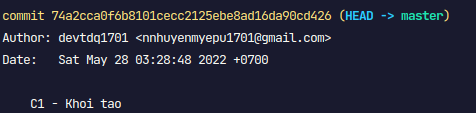
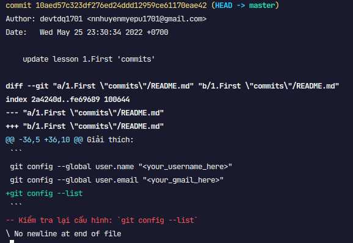
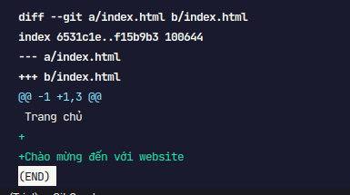
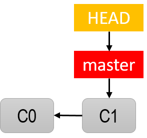

# Bài 2 - log, show, diff

**1. git log**

- xem lịch sử commit trên current branch
  
  Trong đó:

  - thứ tự mới trên - cũ dưới
  - graph của repo: 
  - `HEAD -> master`: con trỏ HEAD cho biết chúng ta đang làm việc ở branch nào và đang ở vị trí nào trong lịch sử commit.

- giới hạn n commit: `git log -n <n>`

- hiển thị mỗi commit trên 1 dòng: `git log --oneline`

**2. git restore**

- để hoàn tác lại các thay đổi bên trong working dir hoặc unstage 1 file ra khỏi index.
  .png>)
  .png>)
- ngoài ra cũng có thể dùng `git checkout -- <file>` khôi phục thay đổi nội dung của filename, việc khôi phục ở trạng thái hiện tại có thể là là khôi phục từ Staged nếu có, nếu không thì khôi phục từ commit cuối. Nếu muốn khôi phục file từ một commit cũ có mã hash thì làm như sau:
  - git checkout [hash] -- filename khôi phục lại filename
  - git checkout [hash] . khôi phục các file về phiên bản theo commit cũ

**3. git show**

- show chi tiết của 1 commit bằng cách truyển vào id của nó

  ```
  git show + <commit id>
  ```

  

  - dấu + màu xanh: nội dung đc thêm vào
  - dấu -- màu đỏ: nội dụng bị xóa bỏ

**4. git diff**

- git diff xem sự thay đổ giữa nội dung ở thư mục làm việc và Staged nếu có, hoặc giữa thư mục làm việc với commit cuối. `git diff --staged` xem sự thay đổi của nội dung trong staged và commit cuối
  
  Giải thích:

  - so sánh file index.html trong TH a (working dir) và b (commit cuối)

- xem những thay đổi giữa những commit với nhau:

  ```
  git diff [commit_this] [commit_that] [--stat]
  ```

- Thực hiện add và commit lại index.html, lúc này graph sẽ trông như này:
  
