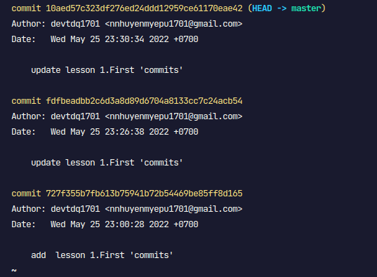
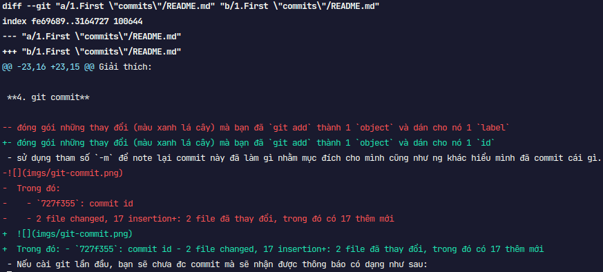

# Bài 2 - log, show, diff

**1. git log**

- xem lịch sử commit trên current branch
  

  - thứ tự mới -> cũ từ trên xuống dưới

- giới hạn n commit: `git log -n <n>`

- hiển thị mỗi commit trên 1 dòng: `git log --oneline`

**2. git show**

- show chi tiết của 1 commit bằng cách truyển vào id của nó

  ```
  git show + <commit id>
  ```

  

  - dấu + màu xanh: nội dung đc thêm vào
  - dấu -- màu đỏ: nội dụng bị xóa bỏ

**3. git diff**

- xem nội dung thay đổi của những file đang `modified`
  

- xem những thay đổi giữa những commit với nhau:
  ```
  git diff [commit_this] [commit_that]
  ```
