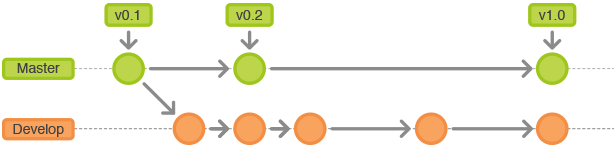
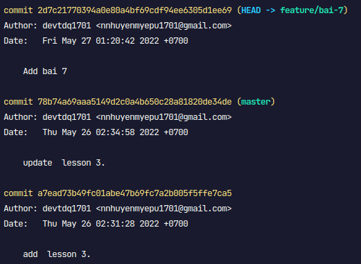
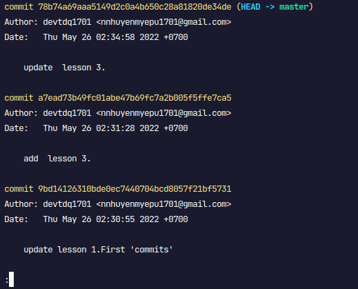
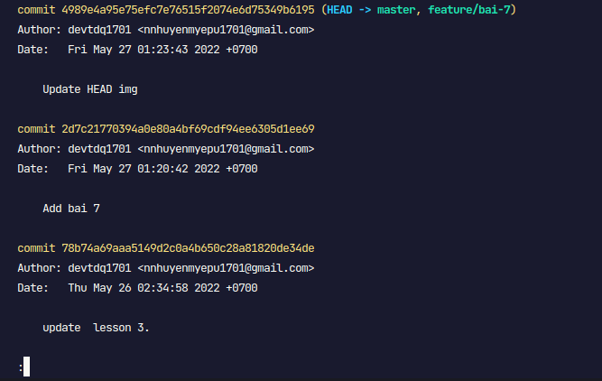

## Cơ bản về Branch

- Tính năng nổi bật của git
- Các nhánh (branches) được dùng để phát triển tính năng riêng độc lập với những nhánh khác.
- Nhánh master là nhánh "mặc định" khi bạn tạo một repository
- Sử dụng các nhánh khác tri đang trong giai đoạn phát triển và merge trở lại nhánh master một khi đã hoàn tất.

> Đây cũng chính là tham số khi ta push lên repo theo cách đơn giản: `git push origin master`



## Câu lệnh làm việc với branch

- Liệt kê các branch đang có trên working tree

```
git branch -a
```

_Chú ý_: dấu \* bên cạnh chỉ branch hiện tại

- tạo một nhánh mới (rỗng):

```
git branch <newbranch>
```

- viết mô tả cho brach:

```
git branch <branchName> --edit-description
```

- tạo 1 branch dựa trên current branch (bao gồm commit) và chuyển sang branch đó:

```
git checkout -b <newbranch>
```

- switch branch:

```

git checkout [branch_name]

```

- rename branch:

```
git branch (-m | -M) [<oldbranch>] <newbranch>
```

- xóa brach:

```
git branch (-d | -D) [-r] <branchname>
```

- push brach lên remote repository

```
git push <remote_server> <branch>
```

- chú ý cách đặt tên 1 brach:

  - chọn tên gọn gàng và make sense

  ```
  git checkout -b new-feature      # good
  git checkout -b T321-new-feature # good (Phabricator task id)
  git checkout -b New_Feature      # bad
  ```

  - quy ước đặt tên feature khi nhiều ng làm trên cùng 1 tính năng:

  ```
  git checkout -b feature-a/master # team-wide branch
  git checkout -b feature-a/maria  # Maria's personal branch
  git checkout -b feature-a/nick   # Nick's personal branch
  ```

# git merge

- Để merge một branch khác vào current brach (vd: master), sử dụng `git merge <branch>`
- Trong cả hai trường hợp, git sẽ cố gắng auto-merge các thay đổi. Không may, điều này không phải lúc nào cũng làm được và thường dẫn đến conflict. Trách nhiệm của bạn là merge các conflict đó thủ công bằng cách chỉnh sửa các file được hiển thị bởi git. Sau khi thay đổi, bạn phải đánh dấu chúng là đã được merge (merged) với lệnh `git add <filename>`
- Trước khi merge các thay đổi, bạn có thể xem trước chúng bằng cách:`git diff <source_branch> <target_branch>`
- Cùng xem thay đổi của HEAD khi sử dụng `git checkout -b` và `git merge`:

 ->  -> 

- khi merge xong, nếu không vì lý dó nào đó hãy xóa nó đi
